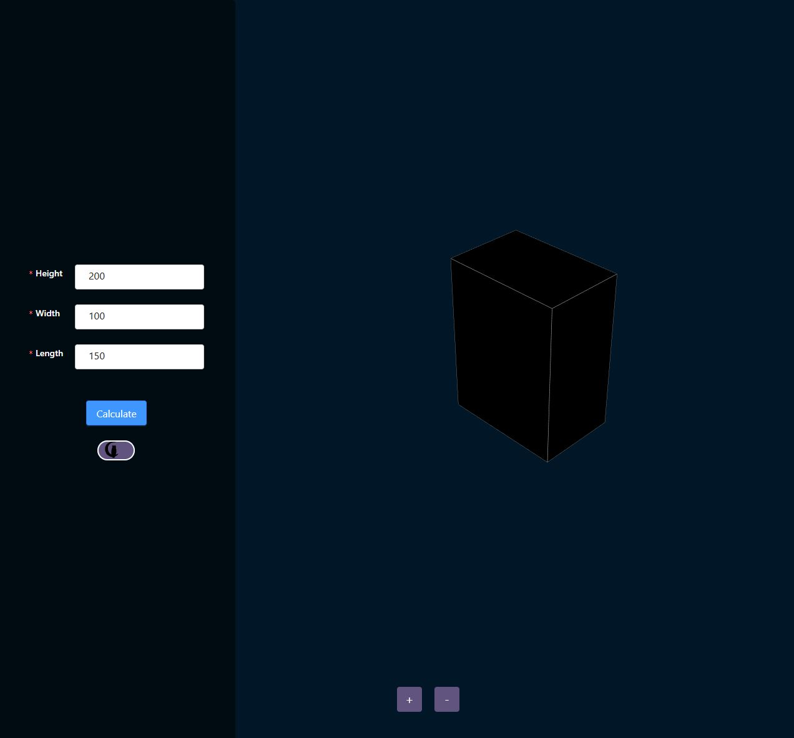
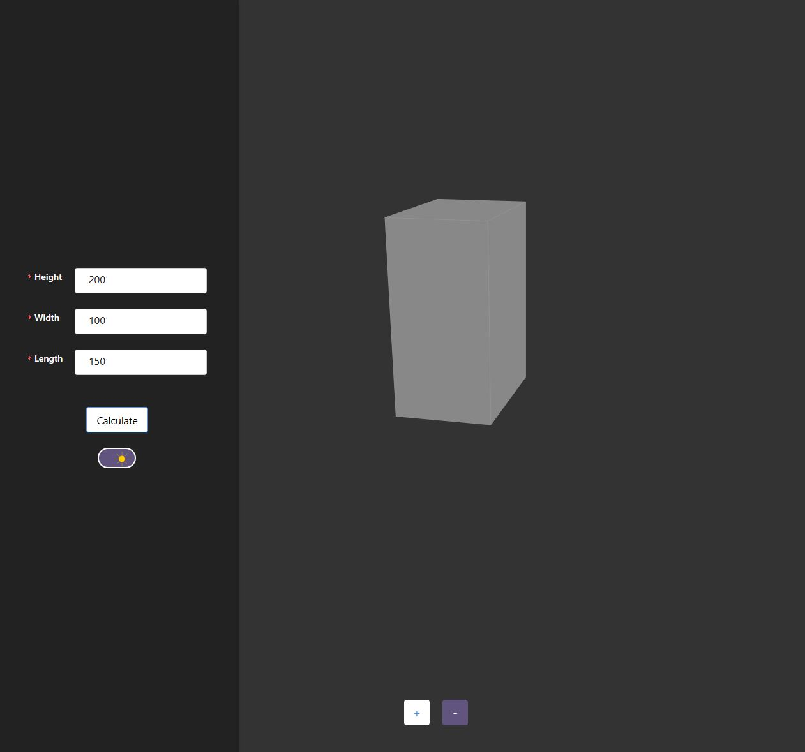

# Тестовое задание на позицию Web-разработчика

### React + TS

## The Task.

Create a simple client-server web app that includes a 3D box in a Three.js scene and a
form to set the box parameters (refer to the image for an example).

## The application should satisfy the following:

    1. Everything should be written in Typescript.
    2. The frontend part should be written using React and Three.js (it's okay to use
    wrappers such as react-three-ber)
    3. The user should be able to change the box's length, width, and height via the
      form.
    4. The form should be built using components from a third-party component library
      (Ant Design, Material UI, Radix, React Aria, etc.)
    5. Form elds should be customized using CSS (including non-default states such
      as "focus").
    6. The form should send the parameters to the server and get back data for the
      display of the box.
    7. The box should be displayed using BufferGeometry. Triangulation of the box (i.e.
      a set of triangles to be used for display) must be computed on a server (see
      below for a tip on how to implement that)

## Tip 1: How to compute triangulation of the box

To implement a 3D object in 3D view you will need
triangulated representation (i.e. a 3D object is represented in
the form of triangles). A box can be easily represented with
12 triangles (2 per each face – see image on the right).
Coordinates of vertices of these triangles can be easily
calculated using box length, width and height (e.g. {0,0,0},
{L,0,0}, {L,0,H}, …).

## Tip 2: Backend.

For this task, a cloud function should be enough, but you are free to implement a full
server.

## Additional assignment (this will help you stand out).

  - Implement a dark mode switch that affects both the 3D-scene and form section.

  ## Скриншот

  
  